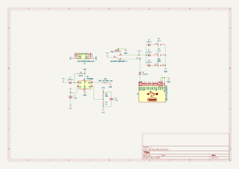

# CR123A SAO

This is an evaluation board to test the viability of using LiMnO2 CR123A cells in a 3P1S configuration on the Swadge.

</img>

Attendees are reporting that their Swadges are too heavy. This is largely due to the 3xAA batteries, 24g each, used to power the Swadge in a 1P3S configuration. Batteries were evaluated, and CR123A batteries were selected for further evaluation on the SAO. They weigh in at 17g each.

CR123A are non-rechargeable, Lithium Chemistry batteries commonly used in camera and firearm accessory applications. They have a higher C rating than other traditional batteries (thanks to the Lithium Chemistry) and are safer than a traditional Lithium Ion or Lithium Polymer rechargeable battery. They maintain a steady voltage level of ~2.9V and discharge curves suggest approximately a 12hr battery life at 100mA continuous draw.

Preliminary testing showed:
1. Big Bug was pulling ~225mA
2. Swadge hero ~90% brightness with light show ~100mA
3. Main menu ~90mA-100mA

This is with the MT3410 + 5V USB input. 225mA at 5V is a whopping 1.125W. If we assume that same power draw and change to a 3P1S 3.0V source, we should expect to see 375mA draw (1.125W/3.0V) from the 3 cells, or 125mA per cell.

To prevent charging of the cells and imbalances, a Schottky Diode follows each battery into the boost converter circuit. This is the only “battery management system” on board. It is possible (but unwise) to put in the RCR123A batteries (rechargeable Lithium Ion) although they have the same form factor, as there is no individual cell monitoring on this board. Installing a battery backwards will likely be catastrophic. <b>This board is a fire hazard and should not be used except for very specific battery testing. More protection circuitry is required on a production Swadge.</b>

The MT3608L Boost converter is from the same family of voltage regulators as the existing regulator on the 2025 Super Swadge. It has an adjustable overcurrent setting that is set by changing the value of R3. The schematic recommends 50k minimum, 96k maximum impedance to set the over-current limit between 0.5A (96k) to 1A (50k). I think we should set this overcurrent limit to around 0.5A to avoid damaging the cells.  This circuit reuses the 2.2uH inductor from the current Swadge power circuit. R1 and R2 were selected to output 3.3V; the reference voltage at Fb is 0.6V and a voltage divider is built to set output voltage. The value of R1 was selected to improve EMI characteristics. Increasing this impedance will likely reduce leakage current at the expense of EMI. Capacitors and diodes were selected per the datasheet recommendations.

# Testing Plan

The testing plan for this SAO is in two phases.

First is to attach it to a Hot Dog and monitor current draw from the USB on the SAO. This is to accomplish two tasks:
1. Compare against the MT2410 to evaluate power efficiency and noise of this new voltage regulation circuit
2. Gather more benchmark data to evaluate the battery performance

The states to be evaluated are:

1. Idle on Main Menu at max LED and TFT brightness, no screensaver
2. Big Bug at max brightness, maximum volume, general gameplay for 30 minutes and logging current consumption approximately every 60 seconds
3. Colorchord at 7 gain, LED 8, Max Screen Brightness Rainbow
4. Stepwise 0-7 TFT brightness on Main Menu
5. Stepwise 0-8 LED brightness on Main Menu
6. UTTT Wireless Connect Menu at max LED and TFT brightness

In theory, this will help us characterize current draw in various Swadge modes and help estimate run time in hours.

Second is to install the batteries and:
1. Monitor and log voltage at the diode node to GND over time
2. Monitor and log cell voltage at each node to GND over time

This will discharge a few sets of CR123A batteries in a few different states to characterize their charge time and see if the cells are staying relatively balanced. The states evaluated will be:
1. Big Bug at max brightness, maximum volume, general gameplay
2. Idle on Main Menu at max LED and TFT brightness, no screensaver
3. UTTT Wireless Connect Menu at max LED and TFT brightness

Durations for these tasks will be chosen based on the results of the first set of tests.

